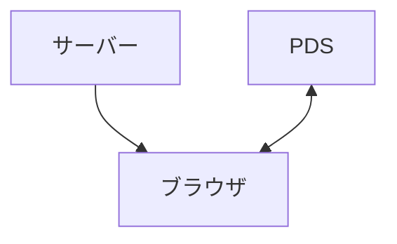

この記事は[Bluesky / ATProtocol Advent Calendar 2025](https://adventar.org/calendars/12255)の8日目の記事です。

AT Protocol(以降、本文ではatproto)は[Bluesky](https://bsky.app/)で使われている技術ですが、実はSNS以外にも色々作れます。

私は[Linkat](https://linkat.blue/)というatprotoを使ったリンク集サービスを2024年末ごろに作りました。それから1年ほど経ってみて感じた、個人開発の手段としてのatprotoの良いところを書いてみます。

## AT Protocolとは

atprotoは大雑把に言えばAPI付きストレージ[^1]のようなものを全アカウントが持っているネットワークです。

<!-- textlint-disable -->

[^1]: [atproto入門1 PDSって？どういう特徴があるの？？](https://whtwnd.com/did:plc:fzkpgpjj7nki7r5rhtmgzrez/3kpf7sy4wnq2d)という記事で見た納得感ある例えです。

<!-- textlint-enable -->

https://atproto.com/

このAPI付きストレージのようなものをPersonal Data Server、PDSと言います。そしてこのPDSからは誰でもデータを取得できます。

例えば私のリンク集のデータをPDSから取得すると、以下のように非常に単純なJSONになっています。なおこの構造は開発者自身が定義できます。

```json
{
  "$type": "blue.linkat.board",
  "cards": [
    {
      "url": "",
      "text": "Linkatを開発しています"
    },
    {
      "url": "https://twitter.com/mkizka",
      "text": "Twitter"
    },
    {
      "url": "https://github.com/mkizka",
      "text": "GitHub"
    }
    // ...
  ]
}
```

atprotoではこのようなJSONデータを使ってサービスを開発出来ます。

## すでにあるアカウントとデータを使って始められる

個人開発を始めるとき最初は利用者含めて何もないのが普通ですが、atprotoでは既存のアカウントとそのデータを利用できます。

例えば私が開発したLinkatではプロフィールの表示にBlueskyのプロフィールデータをそのまま使っています。


これが便利で、サービス内でプロフィール編集機能を提供していなくてもアイコンや名前を表示できます。

他にもユーザーの認証認可もatprotoに乗っかることが出来るので、考えることが少なく済みます。これは個人開発において大きなメリットだと思います。

## サービス同士がつながる

上で挙げたのはBlueskyのデータを利用する例でしたが、逆にLinkatのデータを使っているサービスもあります。

Blueskyクライアントの[TOKIMEKI](https://tokimeki.blue/)、[Klearsky](https://klearsky.pages.dev/)や、Blueskyユーザーの紹介サービス[SkyBeMoreBlue](https://www.skybemoreblue.com/)では、プロフィールにLinkatへのリンクやLinkatで設定したリンクが表示されています。他にもいくつか利用例があります。

| TOKIMEKI                                 | Klearsky                                 | SkyBeMoreBlue                                 |
| ---------------------------------------- | ---------------------------------------- | --------------------------------------------- |
|  |  |  |

このようにサービス同士が自由にデータを使うことが出来るので、相互に連携したサービスが生まれるという面白さがあります。もちろんそれぞれのサービスで使うのは同じアカウントです。

## DBなしでサービスが作れる(場合もある)

データを読み書き出来るサーバーがすでにあるということは、そのままデータベース代わりに使ってサービスが作れます。個人開発でデータベースにかかるコストって大きいんですよね。

ただし作れるものはブラウザと各ユーザーのPDSが直接通信するようなサービスに限ります。以下の図のような構成です。



PDSにデータを保存して取り出して完結するような、例えばTODOアプリや勉強記録、短縮リンクサービスなどが作れます。

サービス実装を完全に静的サイトにしてGitHub PagesやCloudflare Pagesなどを使えば、完全無料で運営することも目指せます。

## AT Protocolの遊び方

atprotoの良いところを紹介してきました。これから試してみたい方には公式から分かりやすいチュートリアルが出ています。

https://atproto.com/ja/guides/applications

こちらはこの記事で紹介した単純なパターンではなく、ExpressサーバーとDBを使ったより本格的な構成になっています。

## まとめ

個人開発目線でのatprotoで良いところを紹介しました。

- 既存のアカウントとデータを使って始められる
- サービス同士がつながる面白さがある
- 構成次第ではDBなしで作れる

興味があればぜひ触ってみてください。
